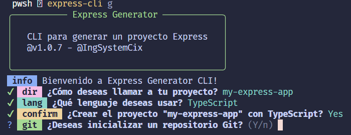

# @ingsystemcix/express-cli

`@ingsystemcix/express-cli` es una herramienta de línea de comandos (CLI) para generar aplicaciones Express.js rápidamente. Con esta CLI, puedes crear proyectos de Express en JavaScript o TypeScript y configurar todo el entorno con las dependencias necesarias, lo que hace que el proceso de inicio de un nuevo proyecto sea más eficiente.



## Changelog

### v1.0.7 (2025-04-01)
- Corregidos los errores de la versión 1.0.6.
- Se implemento un nuevo diseño mas compacto.

### v1.0.6 (2025-04-01)
- Corregidos los errores de la versión 1.0.5.

### v1.0.5 (2025-04-01)
- Versión con errores conocidos. **No utilizar esta versión**.

### v1.0.4 (2025-04-01)
- Versión con errores conocidos. **No utilizar esta versión**.

### v1.0.3 (2025-04-01)
- Versión con errores conocidos. **No utilizar esta versión**.

### v1.0.2 (2025-04-01)
- Versión con errores conocidos. **No utilizar esta versión**.

### v1.0.1 (2025-04-01)
- Versión con errores conocidos. **No utilizar esta versión**.

## Instalación

### Requisitos Previos

Antes de usar la CLI, asegúrate de tener instalado [Bun](https://bun.sh/) en tu sistema.

### Instalación Global

Para instalar `@ingsystemcix/express-cli` de manera global en tu sistema, ejecuta el siguiente comando:

```bash
npm install -g @ingsystemcix/express-cli
```

## Uso

### Generar un Proyecto Express

Una vez instalada la CLI, puedes generar un nuevo proyecto de Express ejecutando el siguiente comando:

```bash
express-cli g
```

La CLI te pedirá información sobre el nombre del proyecto y el lenguaje que deseas usar (JavaScript o TypeScript). También te pedirá una confirmación antes de crear el proyecto. Si todo está correcto, procederá a generar la estructura del proyecto y a instalar las dependencias.

### Ejemplo de salida:

```bash
¿Como deseas llamar a tu proyecto? (my-express-app)
¿Qué lenguaje deseas usar? (JavaScript | TypeScript)
¿Estás seguro de que deseas crear el proyecto "my-express-app" con TypeScript? (Y/n)
🚀 Creando el proyecto "my-express-app"... 
Instalando dependencias...
```

## Estructura del Proyecto Generado

Al generar un proyecto con `@ingsystemcix/express-cli`, se creará una estructura básica con los siguientes archivos:

```bash
my-express-app/
  ├── src/
  │   └── index.ts (o index.js dependiendo de la elección)
  ├── package.json
  ├── tsconfig.json (solo para proyectos TypeScript)
```

### Dependencias

- **express**: Framework de servidor web.
- **cors**: Middleware para permitir solicitudes de recursos cruzados.
- **dotenv**: Cargar variables de entorno desde un archivo `.env`.
- **nodemon**: Reiniciar automáticamente el servidor durante el desarrollo.

### Dependencias de Desarrollo

- **typescript**: Para proyectos TypeScript.
- **ts-node**: Para ejecutar TypeScript directamente sin compilación.
- **@types/node**: Tipos para Node.js.
- **@types/express**: Tipos para Express.js.

## Licencia

MIT © [Juan Bladimir Romero Collazos](https://github.com/IngSystemCix)